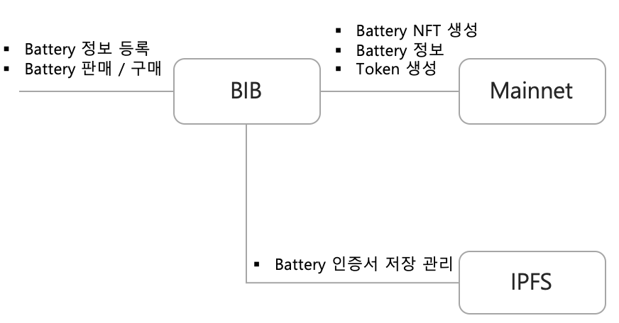
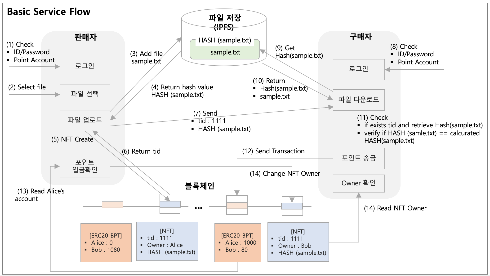
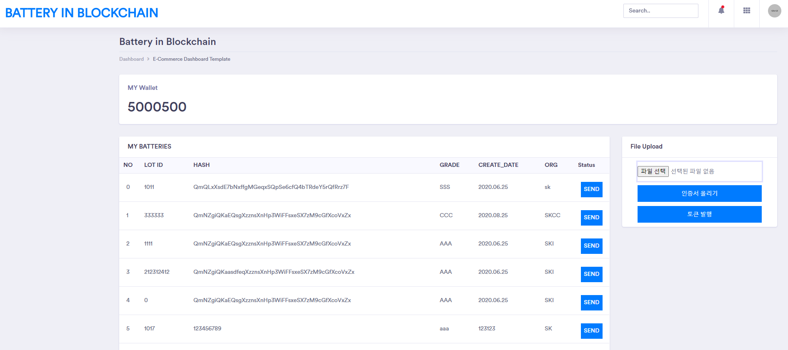
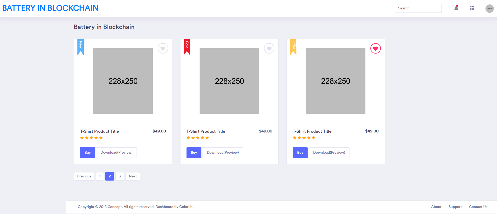

# BIB (Battery In Blockchain) 서비스
IPFS+Blockchain 플랫폼에서 Battery 인증서의 진위여부와 거래를 제공해 주는 서비스.

#### Basic Architecture

- BIB
Battery 관련 정보를 등록하고, 구매자와 판매자 페이지를 통해 구매/소유권 이전과 같은 서비스를 제공하는 웹서버.

- Mainnet
각 Battery별 NFT (ERC721기반)를 생성 / 관리하며, 거래에 따른 Token (ERC20기반) 보상 서비스를 제공하는 이더리움 블록체인.

- IPFS
Battery의 인증서 파일을 저장 관리하는 분산 파일시스템.

### 서비스 구조

### 시나리오 별 구현 내용   
* S1. EV Battery의 핵심 데이터를 바탕으로 Battery 등급 판정   
  > 구매자가 최초 사용자 등록하고 로그인 시에 ERC20 계정을 생성함.  
  > 구매자가 중고 배터리 검증을 요청과 검증기관에서 결과를 등록하는 과정을 한데 묶어 판매자 화면에서 같이 입력/처리 하도록 구현함.   
  > 각 배터리의 Identity는 배터리 S/N 와 같은 고유번호로 정의함.   

* S2. Battery 등급 판정에 대한 인증서 발급 정보와 인증서 File에 대한 Hash 값 블록체인 저장   
  > 발급된 인증서 파일을 선택하여 업로드 버튼을 누르면,  
  > * Batter S/N, 인증날자, 기관, 등급 입력.   
  > * 원본 파일은 IPFS 분산 네트워크에 저장.   
  > * 원본 파일의 해쉬값과 인증서 주요 정보 (인증날자, 기관, 등급)는 블록체인내의 Battery NFT 토큰내 token ID (Battery S/N와 매핑)에 연결되어 저장.   
  > 이때 발행된 token ID의 owner는 구매자가 되고, 마켓플레이스에 hass 값과 같이 등록 됨. 

* S3. 그 인증서에 대한 원본 진위 여부 검증 Smart Contract 
* S4. 원본 진위여부가 검증 되면, EV Battery 거래 당사자간 Token 송금   
  > 구매자가 marketplace 화면에서 판매자의 중고 배터리를 선택하고 구매 버튼을 누르면, 해당 배터리의 toke ID와 hash 값을 블록체인과 IPFS에서 조회하고 비교한 뒤 이상이 없는지 확인.  
  > 1000 BPT가 판매자에게 전송됨.

* S5. Token 송금 여부 확인 되면, EV Battery 소유권 이전 Smart Contract   
  > 판매자가 입금을 확인하고 해당 배터리 인증서의 ownership을 구매자로 변경하면, 판매자의 판매 리스트에서 해당 배터리가 사라지고, 구매자는 배터리 인증서를 IPFS로 부터 다운로드 받을 수 있음.

### Application  

판매자 UI

구매자 UI
   

### 모듈 설명 (상세)
* [BIB Web Server](./BIB.md)   
* Smart Contract
   - [ERC721 - Battery NFT](https://github.com/yami2254/SK_BlockChain_First/tree/master/token/NFT)
   - [ERC20 - BPT 토큰](https://github.com/yami2254/SK_BlockChain_First/tree/master/token/ERC20)
* [Private IPFS Network](https://github.com/yami2254/SK_BlockChain_First/tree/master/makeipfs)

  
### Contributors

* 오세진수석  
* 정재학선임 
* 이상호선임
